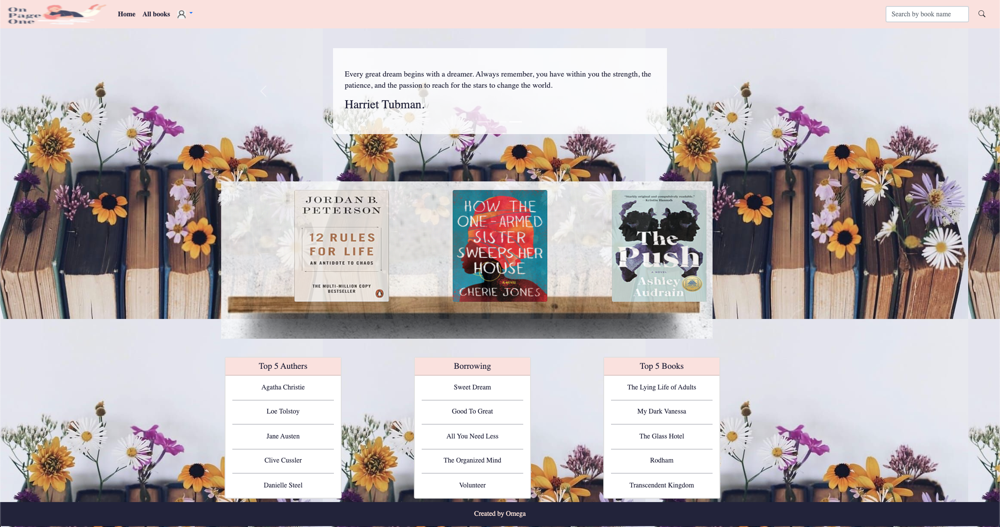
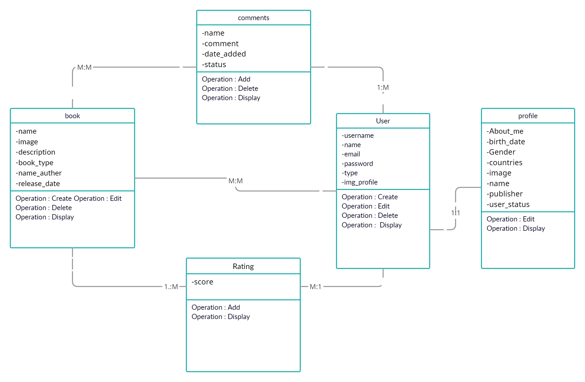
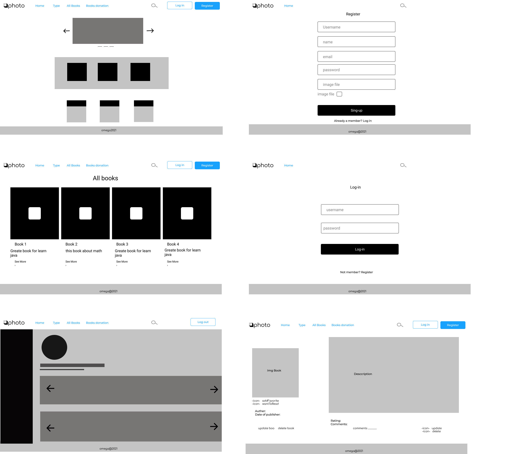

## About
**'On-Page One'** classifies books based on the type to facilitate user search. It also displays quotes from some books, and it allows the feature of resin and adds a comment to make it easier for people if it's valuable before it is contained.
Provides a borrowing service between users to grow a culture of reading.
**Omega Team Members:**
* Muneerah Asiri
* Hussain Alsadun
* Shahad Albaydhani



<!-- [The Website](https://git.generalassemb.ly/hussain/from-what-I-read.git) -->
## General Approach
* Started plan with design ERD 
* Then, made prototype wireframes for pages
* After that, started to building Back-End pages
* Then, entered to designing Front-End pages
* Testing and debugging error a website
* At the end submitted data into a database 
## Installation Instructions
```sh
    $ git clone <url from-what-I-read> #clone our repo
    $ cd <cloned folder name> # change directory 
    $ pipenv shell # start workspace
    $ pipenv install django #install django, and the app used
    $ psql # To Connect to the database
    `postgres=` CREATE DATABASE fromWhatIRead;# To create tunr
    `postgres=` \q # To quit the database
    $ python manage.py createsuperuser # Creating an admin 
    $ python manage.py makemigrations
    $ python manage.py migrate
    $ python manage.py runserver # start server
```

## Entity Relationship Diagram (ERD)
The database of this project have 5 tables (User, Profile, Book, Comments, Rating). A relationship between tables:
* Every User must have one Profile -One To One-.
* For every Books many Comments -Many To Many-.
* For every Books many Rating -Many To Many-.
* Each Users can do many Rating -Many To Many-.
* Each Users can have many Books -Many To Many-.
* Each Users can write many Comments -Many To Many-.
## Wireframe

* **Wireframe 1**<br>
The home page displays a search box through it, so users can search on a book. Then, displays some quotes from books in slides show, after that contain shelf for trend books for this month. At the bottom, the show lists the top 5 of authors and books, also the list of borrow books and volunteer.
* **Wireframe 2**<br>
The All Books page displays all type of books on the site, at time user click on **'click more'**  will lead to another page that shows a detail of the book.
* **Wireframe 3**<br>
Lastly, the user profile will display the user’s information, and list of favorite books, list want to read. And in this page user can edit profile information or delete it.
* **Wireframe 4/5**<br>
The forms sign in/up and let a user create an account and used it on a website.
* **Wireframe 6**<br>
A view page will display all details related to the book, and from this page, you can add the book to the favorite list or even to a want-to-read list via the dedicated button for each. Also, the user can rate the book and write him comment, update or delete.
<br>
## User Stories
* As a User, I need to reseat my password via my email, since forget old password.
* As a User, I need to add some books to my profile I attend to read it later, to be back to it.
* As a User, I want to rating a books after read it, to help people decide as for read it or no.
* As a User, I want to write a comments on a book, to give people my opinion on book.
* As an Admin, I need to hide some comments, that's may distortion a site.
* As an Admin, I need to delete a book when have low rating, to make space for other books.
## Demo
<!--  -->
## Most difficult part of the project
Most difficult part was making rate on a book

```JavaScript
// Rating Book
const handleStarSelect = (size) => {
    const children = form.children
    for (let i = 0; i < children.length; i++) {
        if (i <= size) {
            children[i].classList.add('checked')
        } else {
            children[i].classList.remove('checked')
        }
    }
}
if (one) {
    const arr = [one, two, three, four, five]
     arr.forEach(item => item.addEventListener('mouseover', (event) => {
         handleSelect(event.target.id)
     }))

    arr.forEach(item => item.addEventListener('click', (event) => {
        const val = event.target.id
            isSubmit = true
            const id = event.target.id
            const val_num = getNumericValue(val)
            $('#rate_input').val(getNumericValue(event.target.id))
    }))
}

```
## What to Add Next
* Upgrade website's design
* Users can read the books from our site
* User can chating with volunteer to how borrow a book
* Users can follow each other
* Sending a messages to user's emails when a new book is publishered
## Technologies
* HTML/CSS
* JavaScript
* Postgres
* Bootstrap
* Django
* Python
* Visual Studio Code
## Resources
* [Trello: manage project tasks](https://trello.com/en)
* [Figma: design a Wireframe ](https://www.figma.com/)
* [Pinterest: images](https://www.pinterest.com)
* [Color palette picker](https://coolors.co/)
* [Canva: make a logo](https://www.canva.com)
* [Icons](https://fontawesome.com/)
* [Quotes](https://blog.hubspot.com/sales/famous-quotes)
